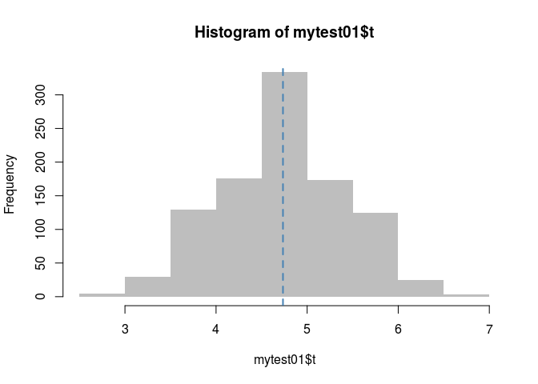
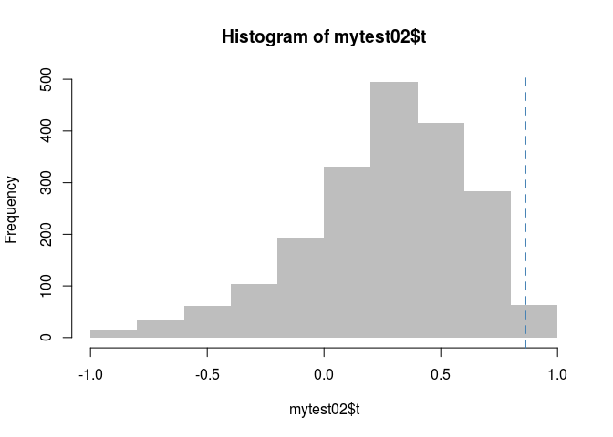

<!-- README.md is generated from README.Rmd. Please edit that file -->

[](https://www.tidyverse.org/lifecycle/#experimental)

# gnet

The goal of gnet is to …

## Installation

You can install the released version of gnet from
[CRAN](https://CRAN.R-project.org) with:

``` r
install.packages("gnet")
```

## Support

This material is based upon work support by, or in part by, the U.S.
Army Research Laboratory and the U.S. Army Research Office under grant
number W911NF-15-1-0577

Computation for the work described in this paper was supported by the
University of Southern California’s Center for High-Performance
Computing (hpcc.usc.edu).

## Example

This is a basic example which shows you how to solve a common problem:

``` r
library(ergmito)
library(gnet)


# A random sample of networks
set.seed(12)
nets <- rbernoulli(c(3,3,4,4,4))

# Are the edgecounts random??
fun <- function(g, y) mean(count_stats(g, "edges") - y, na.rm = TRUE)

mytest01 <- struct_test(nets ~ edges + balance, y = runif(5), R=1000, stat=fun)
```

``` r
mytest01
#> Test of structural association between a network and a graph level outcome
#> # of obs: 5
#> # of replicates: 1000 (1000 used)
#> Alternative: two.sided
#> S[1] s(obs): 4.6689 s(sim): 4.6931 p-val: 0.9080
```

``` r
# Looking at the distribution
hist(mytest01$t, breaks=10, col="gray", border="transparent")
abline(v = mytest01$t0, col="steelblue", lwd=2, lty="dashed")
```



Using the fivenets dataset included in `ergmito`. In this example, we
show how the model can be use to discover an association between

``` r

# Loading the fivents dataset. We actually know that data generating process,
# so we use these paramaters for the model
data(fivenets, package="ergmito")

# We will generate a group level variable that is related to the proportion of
# females in the group
set.seed(52)
y <- count_stats(fivenets ~ nodematch("female"))
y <- y + rnorm(nnets(fivenets), sd = 2)

# Performing the struct test
f02 <- function(g, y) cor(count_stats(g ~ nodematch("female")), y, use = "complete.obs")[1] 
mytest02 <- struct_test(
  fivenets ~ edges + nodematch("female"), y = y, R=2000,
  stat = f02
  )
#> Warning in cor(count_stats(g ~ nodematch("female")), y, use =
#> "complete.obs"): the standard deviation is zero

#> Warning in cor(count_stats(g ~ nodematch("female")), y, use =
#> "complete.obs"): the standard deviation is zero
mytest02
#> Test of structural association between a network and a graph level outcome
#> # of obs: 5
#> # of replicates: 2000 (1998 used)
#> Alternative: two.sided
#> S[1] s(obs): 0.8624 s(sim): 0.2631 p-val: 0.0210

hist(mytest02$t, breaks=10, col="gray", border="transparent")
abline(v = mytest02$t0, col="steelblue", lwd=2, lty="dashed")
```



What would have we got if we use correlation or a linear regression
only?

``` r
# Pearson correlation
x <- count_stats(fivenets ~ nodematch("female"))

cor.test(x, y)
#> 
#>  Pearson's product-moment correlation
#> 
#> data:  x and y
#> t = 2.9513, df = 3, p-value = 0.05996
#> alternative hypothesis: true correlation is not equal to 0
#> 95 percent confidence interval:
#>  -0.08290487  0.99080307
#> sample estimates:
#>       cor 
#> 0.8624443
summary(lm(y ~ x))
#> 
#> Call:
#> lm(formula = y ~ x)
#> 
#> Residuals:
#>       1       2       3       4       5 
#> -0.2304 -2.1519  3.3243  0.5473 -1.4894 
#> 
#> Coefficients:
#>             Estimate Std. Error t value Pr(>|t|)  
#> (Intercept)  -3.8115     2.4666  -1.545     0.22  
#> x             2.0347     0.6894   2.951     0.06 .
#> ---
#> Signif. codes:  0 '***' 0.001 '**' 0.01 '*' 0.05 '.' 0.1 ' ' 1
#> 
#> Residual standard error: 2.467 on 3 degrees of freedom
#> Multiple R-squared:  0.7438, Adjusted R-squared:  0.6584 
#> F-statistic:  8.71 on 1 and 3 DF,  p-value: 0.05996
```

In this case, the test has higher power than the other 2.
