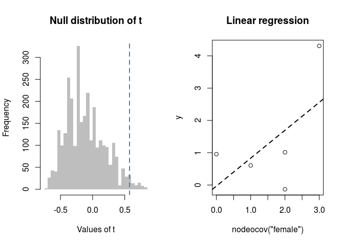

<!-- README.md is generated from README.Rmd. Please edit that file -->

[](https://www.tidyverse.org/lifecycle/#experimental)
[](https://travis-ci.org/muriteams/gnet)
[](https://ci.appveyor.com/project/gvegayon/gnet)

# gnet

The goal of gnet is to …

## Installation

~~You can install the released version of gnet from
[CRAN](https://CRAN.R-project.org) with:~~

``` r
devtools::install_github("muriteams/gnet")
```

## Support

This material is based upon work support by, or in part by, the U.S.
Army Research Laboratory and the U.S. Army Research Office under grant
number W911NF-15-1-0577

Computation for the work described in this paper was supported by the
University of Southern California’s Center for High-Performance
Computing (hpcc.usc.edu).

## Example

This is a basic example which shows you how to solve a common problem:

``` r
library(ergmito)
library(gnet)


# A random sample of networks
set.seed(12)
nets <- rbernoulli(c(3,3,4,4,4))

# Are the edgecounts random??
fun <- function(g, y) mean(count_stats(g, "edges") - y, na.rm = TRUE)

mytest01 <- struct_test(nets ~ edges + balance, y = runif(5), R=1000, stat=fun)
#> Warning: The observed statistics (target.statistics) are near or at
#> theboundary of its support, i.e. the Maximum Likelihood Estimates maynot
#> exist or be hard to be estimated. In particular, the statistics "balance".
```

``` r
mytest01
#> Test of structural association between a network and a graph level outcome
#> # of obs: 5
#> # of replicates: 1000 (1000 used)
#> Alternative: two.sided
#> S[1] s(obs): 4.7347 s(sim): 4.7169 p-val: 0.8660
```

``` r
# Looking at the distribution
hist(mytest01$t, breaks=10, col="gray", border="transparent")
abline(v = mytest01$t0, col="steelblue", lwd=2, lty="dashed")
```


Using the fivenets dataset included in `ergmito`. In this example, we
show how the model can be use to discover an association between

``` r

# Loading the fivents dataset. We actually know that data generating process,
# so we use these paramaters for the model
data(fivenets, package="ergmito")

# We will generate a group level variable that is related to the proportion of
# females in the group
set.seed(52)
y <- count_stats(fivenets ~ nodeocov("female"))
y <- y + rnorm(nnets(fivenets))

# Performing the struct test
f02 <- function(g, y) cor(count_stats(g ~ nodeocov("female")), y, use = "complete.obs")[1] 
mytest02 <- struct_test(
  fivenets ~ edges + nodematch("female"), y = y, R=3000,
  stat = f02
  )
mytest02
#> Test of structural association between a network and a graph level outcome
#> # of obs: 5
#> # of replicates: 3000 (3000 used)
#> Alternative: two.sided
#> S[1] s(obs): 0.5742 s(sim): -0.1120 p-val: 0.0347
```

What would have we got if we use a linear regression only?

``` r
# Li
x <- count_stats(fivenets ~ nodeocov("female"))
summary(lm(y ~ x))
#> 
#> Call:
#> lm(formula = y ~ x)
#> 
#> Residuals:
#>       1       2       3       4       5 
#> -0.6817 -0.2262  1.7489  0.9875 -1.8286 
#> 
#> Coefficients:
#>             Estimate Std. Error t value Pr(>|t|)
#> (Intercept) -0.03279    1.34965  -0.024    0.982
#> x            0.86414    0.71133   1.215    0.311
#> 
#> Residual standard error: 1.622 on 3 degrees of freedom
#> Multiple R-squared:  0.3297, Adjusted R-squared:  0.1063 
#> F-statistic: 1.476 on 1 and 3 DF,  p-value: 0.3113
```

``` r
op <- par(mfrow=c(1, 2))
hist(mytest02$t, breaks=50, col="gray", border="transparent", main = "Null distribution of t",
     xlab = "Values of t")
abline(v = mytest02$t0, col="steelblue", lwd=2, lty="dashed")
plot(y ~ x, main = "Linear regression", xlab="nodeocov(\"female\")", ylab = "y")
abline(lm(y~x), lty="dashed", lwd=2)
```



``` r
par(op)
```

In this case, the test has higher power than the other 2.
